# Cognitive Tool-Orchestrated Incident Response System (CTOIR)

## A Multi-Agent Architecture for Financial Services IT Operations

------

## The Challenge: Why Current Incident Response Falls Short

In the high-stakes environment of financial services IT operations, every minute of downtime can translate to millions in losses and regulatory scrutiny. Traditional incident response systems, despite decades of refinement, still struggle with three fundamental limitations:

**The Knowledge Gap**: Critical institutional knowledge exists only in the minds of senior engineers who aren't available 24/7. When a novel incident occurs at 3 AM, junior incident managers are left searching through fragmented documentation and chat histories.

**The Context Scatter**: Information needed to resolve incidents is scattered across multiple systems - Dynatrace shows real-time metrics, Splunk contains historical logs, ServiceNow tracks past incidents, and the Configuration Management Database (CMDB) holds service relationships. No single person can synthesize all this data quickly enough.

**The Compliance Complexity**: Every resolution action must comply with financial regulations around data residency, segregation of duties, and audit trails. Manual compliance checking adds precious minutes to resolution times while introducing human error risks.

These challenges manifest in measurable business impact: Mean Time to Resolution (MTTR) averages 45 minutes for routine incidents and up to 3 hours for complex outages. Worse, 70% of incidents are variations of previously-solved problems, yet teams repeatedly "rediscover" solutions rather than leveraging institutional memory.

------

## The Solution: Cognitive Tool Orchestration

The **Cognitive Tool-Orchestrated Incident Response System (CTOIR)** addresses these challenges through a fundamentally different approach: instead of replacing human expertise, it amplifies it by providing an AI-powered cognitive partner that can reason across all available data sources simultaneously.

### Core Innovation: The Orchestrator Brain

At the heart of CTOIR lies a **fine-tuned 8-billion parameter Small Language Model (SLM)** that acts as a cognitive orchestrator. Unlike simple retrieval systems, this orchestrator can:

- **Reason about uncertainty**: Distinguish between incidents that match known patterns (fast resolution) versus truly novel problems (requiring deeper analysis)
- **Coordinate multiple data sources**: Simultaneously query historical incidents, real-time telemetry, and service dependency graphs
- **Learn from outcomes**: Continuously improve its decision-making through reinforcement learning based on resolution success

This orchestrator coordinates specialized agents, each designed for specific aspects of incident response:

```mermaid
graph LR
    INCIDENT[🚨 Incident Detected] --> ORCHESTRATOR{🧠 Orchestrator SLM}
    
    ORCHESTRATOR --> HIRAG[📚 hiRAG Agent<br/>Historical Incidents]
    ORCHESTRATOR --> CIRAG[⚡ ciRAG Agent<br/>Current Context]
    ORCHESTRATOR --> KG[🕸️ Knowledge Graph<br/>Service Dependencies]
    ORCHESTRATOR --> METAREG[⚖️ Regulatory Monitor<br/>Compliance Check]
    
    HIRAG --> DECISION[🎯 Resolution Decision]
    CIRAG --> DECISION
    KG --> DECISION
    METAREG --> DECISION
    
    DECISION --> VALIDATION{✅ Confidence Check}
    VALIDATION -->|High Confidence| EXECUTE[🔧 Execute Resolution]
    VALIDATION -->|Low Confidence| ESCALATE[👨‍💼 Human Escalation]
    
    style ORCHESTRATOR fill:#f9f,stroke:#333,stroke-width:4px
    style DECISION fill:#bbf,stroke:#333,stroke-width:2px
    style VALIDATION fill:#fbf,stroke:#333,stroke-width:2px
```



### Dual-Mode Reasoning: Exploit vs. Explore

CTOIR implements two distinct reasoning modes inspired by reinforcement learning theory:

**Exploit Mode** (Fast Path): When the system recognizes an incident pattern with high confidence, it quickly retrieves and adapts the most successful historical resolution. This handles ~70% of incidents in under 5 minutes.

**Explore Mode** (Deep Analysis): For novel or ambiguous incidents, the system conducts comprehensive analysis across all data sources, building new knowledge patterns. This mode takes longer but handles the complex cases that traditionally require senior engineer intervention.

```mermaid
flowchart TD
    INCIDENT[Incident Received] --> CLASSIFY{Pattern Recognition}
    
    CLASSIFY -->|Known Pattern<br/>Confidence > 85%| EXPLOIT[🏃‍♂️ Exploit Mode]
    CLASSIFY -->|Novel/Ambiguous<br/>Confidence < 85%| EXPLORE[🔍 Explore Mode]
    
    EXPLOIT --> HIRAG_FAST[Quick hiRAG Query<br/>Top 3 Similar Incidents]
    HIRAG_FAST --> ADAPT[Adapt Known Solution]
    ADAPT --> VALIDATE_FAST[Regulatory Check]
    
    EXPLORE --> COMPREHENSIVE[Comprehensive Analysis]
    COMPREHENSIVE --> HIRAG_DEEP[Deep hiRAG Analysis<br/>Pattern Discovery]
    COMPREHENSIVE --> CIRAG_LIVE[Live Telemetry Analysis]
    COMPREHENSIVE --> KG_TRAVERSE[Knowledge Graph Traversal]
    
    HIRAG_DEEP --> SYNTHESIZE[Synthesize Novel Solution]
    CIRAG_LIVE --> SYNTHESIZE
    KG_TRAVERSE --> SYNTHESIZE
    SYNTHESIZE --> VALIDATE_DEEP[Full Compliance Check]
    
    VALIDATE_FAST --> EXECUTE[Execute Resolution]
    VALIDATE_DEEP --> EXECUTE
    
    style EXPLOIT fill:#90EE90,stroke:#006400,stroke-width:3px
    style EXPLORE fill:#FFB6C1,stroke:#DC143C,stroke-width:3px
    style EXECUTE fill:#87CEEB,stroke:#4682B4,stroke-width:3px
```



------

## Architecture: How CTOIR Works

### The Orchestrator Core

The system's intelligence stems from its central orchestrator - an 8B parameter language model fine-tuned specifically on financial services incident patterns. This model utilizes a sophisticated reward function that balances multiple objectives:

$$R(\tau) = w_1 \cdot \text{Outcome}(\tau) + w_2 \cdot \text{Efficiency}(\tau) + w_3 \cdot \text{Preference}(\tau) + w_4 \cdot \text{Compliance}(\tau)$$

Where:
- **Outcome** measures resolution success and MTTR reduction
- **Efficiency** optimizes computational costs and tool selection
- **Preference** aligns with human incident manager preferences
- **Compliance** ensures regulatory adherence (unique to financial services)

This multi-objective optimization allows the orchestrator to make nuanced decisions: sometimes spending more computational resources on complex incidents while quickly resolving routine issues.

### System Architecture Overview

```mermaid
graph TD
    ICI["🖥️ INCIDENT COMMAND INTERFACE<br/>Slack, ServiceNow, Web Dashboard, Mobile"]
    
    ORCH["🧠 ORCHESTRATOR LAYER<br/>8B SLM Fine-Tuned on Financial<br/>Services Incident Patterns<br/>Trained via GRPO"]
    
    EXPLOIT["⚡ EXPLOIT MODE<br/>Known Patterns<br/>Fast Resolution"]
    EXPLORE["🔍 EXPLORE MODE<br/>Novel Analysis<br/>Deep Investigation"]
    
    META["🎯 Metacognitive Layer<br/>Confidence Calibration<br/>Uncertainty Estimation"]
    
    TOOLS["🔧 SPECIALIZED TOOLS"]
    KNOWLEDGE["📚 KNOWLEDGE SYSTEMS"]
    
    HIRAG["📚 hiRAG Agent<br/>Historical Incident Analysis<br/>10+ Years ServiceNow Data"]
    CIRAG["⚡ ciRAG Agent<br/>Current Context Integration<br/>Real-time Telemetry"]
    KG["🕸️ Knowledge Graph Engine<br/>Service Dependencies<br/>Root Cause Analysis"]
    METAREG["⚖️ MetaReg Monitor<br/>Regulatory Compliance<br/>Safety Constraints"]
    
    DATA["💾 DATA INTEGRATION LAYER"]
    
    DYN["📊 Dynatrace<br/>Real-time Telemetry<br/>Performance Metrics"]
    SPL["📋 Splunk<br/>Historical Logs<br/>Pattern Analysis"]
    SN["🎫 ServiceNow<br/>Incident Records<br/>CMDB"]
    
    %% Connection flows
    ICI --> ORCH
    ORCH --> EXPLOIT
    ORCH --> EXPLORE
    EXPLOIT -.-> META
    EXPLORE -.-> META
    META -.-> ORCH
    
    ORCH --> TOOLS
    ORCH --> KNOWLEDGE
    
    TOOLS --> HIRAG
    TOOLS --> CIRAG
    KNOWLEDGE --> KG
    KNOWLEDGE --> METAREG
    
    HIRAG --> DATA
    CIRAG --> DATA
    KG --> DATA
    METAREG --> DATA
    
    DATA --> DYN
    DATA --> SPL
    DATA --> SN
    
    %% Styling
    classDef interface fill:#e3f2fd,stroke:#1976d2,stroke-width:2px
    classDef orchestrator fill:#f3e5f5,stroke:#7b1fa2,stroke-width:3px
    classDef mode fill:#e8f5e9,stroke:#388e3c,stroke-width:2px
    classDef metacog fill:#fff3e0,stroke:#f57c00,stroke-width:2px
    classDef agent fill:#fce4ec,stroke:#c2185b,stroke-width:2px
    classDef layer fill:#e0f2f1,stroke:#00796b,stroke-width:2px
    classDef datasource fill:#fff8e1,stroke:#f9a825,stroke-width:2px
    
    class ICI interface
    class ORCH orchestrator
    class EXPLOIT,EXPLORE mode
    class META metacog
    class HIRAG,CIRAG,KG,METAREG agent
    class TOOLS,KNOWLEDGE,DATA layer
    class DYN,SPL,SN datasource
```



### Specialized Agents in Detail

**hiRAG (Historical Retrieval-Augmented Generation)**: This agent specializes in analyzing over 10 years of ServiceNow incident records. Unlike simple keyword matching, hiRAG understands incident semantics and can identify resolution patterns even when symptoms manifest differently. It maintains embeddings of incident trajectories and can retrieve contextually similar cases based on service impact patterns rather than just error messages.

**ciRAG (Current Intelligence Retrieval-Augmented Generation)**: Operating in real-time, ciRAG integrates live telemetry from Dynatrace with recent log patterns from Splunk. It provides situational awareness by correlating ongoing incidents with deployment events, configuration changes, and emerging anomalies. This agent ensures the orchestrator has immediate context about what's happening right now.

**Knowledge Graph Engine**: Perhaps the most sophisticated component, the KG Engine maintains a dynamic graph of service dependencies, historical failure correlations, and team expertise mappings. It can traverse these relationships to identify non-obvious root causes - for example, discovering that database slowness in Service A is actually caused by a memory leak in Service B that shares the same host.

**Regulatory Monitor (MetaReg)**: Unique to financial services implementations, this agent validates every proposed resolution against compliance requirements. It ensures data doesn't cross geographical boundaries inappropriately, verifies that changes follow segregation of duties requirements, and maintains audit trails that satisfy regulatory examination standards.

### The Learning Loop: How CTOIR Improves

CTOIR's learning happens at multiple timescales:


**Immediate Learning**: After each incident resolution, the system updates its confidence scores for similar patterns and records which tools provided the most valuable information.

**Nightly Consolidation**: Every night, the system rebuilds its knowledge graph with the day's new incident data and updates its embeddings to reflect new patterns.

**Weekly Retraining**: The orchestrator undergoes reinforcement learning updates based on the week's outcomes, optimizing its tool selection and reasoning strategies.

This multi-timescale learning ensures that CTOIR rapidly adapts to new failure modes while maintaining stability for well-understood patterns.

------

## The Value Proposition: Why CTOIR Transforms Operations

### Quantitative Impact

CTOIR's business value manifests in measurable operational improvements:

```mermaid
graph TD
    subgraph "Current State"
        CS_MTTR[MTTR: 45 minutes average]
        CS_AUTO[Autonomous Resolution: 0%]
        CS_COST[Cost per Incident: Unmeasured]
        CS_NOVEL[Novel Incident Success: 30%]
    end
    
    subgraph "CTOIR Target State"
        TS_MTTR[MTTR: 27 minutes<br/>40% Improvement]
        TS_AUTO[Autonomous Resolution: 30%<br/>of P3/P4 incidents]
        TS_COST[Cost per Incident: Measurable<br/>tool API + compute costs]
        TS_NOVEL[Novel Incident Success: 60%<br/>100% improvement]
    end
    
    CS_MTTR -.->|Improvement| TS_MTTR
    CS_AUTO -.->|Enablement| TS_AUTO
    CS_COST -.->|Visibility| TS_COST
    CS_NOVEL -.->|AI Amplification| TS_NOVEL
    
    TS_MTTR --> SAVINGS1[💰 Annual Savings<br/>from Faster Resolution<br/>Calculate: MTTR_reduction × incidents/year × cost/minute]
    TS_AUTO --> SAVINGS2[💰 Annual Savings<br/>from Autonomous Handling<br/>Calculate: autonomous_rate × P3/P4_volume × avg_handling_cost]
    TS_NOVEL --> SAVINGS3[💰 Annual Savings<br/>from Better Novel Resolution<br/>Calculate: success_improvement × novel_incidents × escalation_cost_differential]
    
    style CS_MTTR fill:#ffcccc,stroke:#cc0000,stroke-width:2px
    style CS_AUTO fill:#ffcccc,stroke:#cc0000,stroke-width:2px
    style CS_COST fill:#ffcccc,stroke:#cc0000,stroke-width:2px
    style CS_NOVEL fill:#ffcccc,stroke:#cc0000,stroke-width:2px
    
    style TS_MTTR fill:#ccffcc,stroke:#00cc00,stroke-width:2px
    style TS_AUTO fill:#ccffcc,stroke:#00cc00,stroke-width:2px
    style TS_COST fill:#ccffcc,stroke:#00cc00,stroke-width:2px
    style TS_NOVEL fill:#ccffcc,stroke:#00cc00,stroke-width:2px
```



**Mean Time to Resolution (MTTR) Reduction**: By providing incident managers with immediate access to relevant historical patterns and real-time context, CTOIR targets a 40% reduction in resolution time. This translates directly to reduced revenue impact and improved customer experience.

**Autonomous Resolution Capability**: The system can completely resolve 30% of lower-priority (P3/P4) incidents without human intervention, allowing teams to focus on high-impact issues. This autonomous capability is particularly valuable during off-hours and holiday coverage.

**Cost Transparency and Optimization**: Unlike traditional systems where incident resolution costs are hidden in human labor, CTOIR provides precise cost tracking through tool API usage. Computational costs per incident can be tracked and optimized, providing visibility into the true cost of resolution activities compared to manual engineer time.

### Qualitative Benefits

Beyond metrics, CTOIR transforms the incident management experience:

**Cognitive Load Reduction**: Incident managers spend less time gathering information and more time making decisions. The system presents pre-analyzed options rather than raw data dumps.

**Institutional Memory Preservation**: Junior team members gain access to the pattern recognition capabilities that previously existed only in senior engineers' experience. The knowledge graph preserves and amplifies tribal knowledge.

**Proactive Capability Development**: As the system learns, it begins to identify incident precursors, enabling proactive intervention before full outages occur.

**Cross-Team Collaboration**: The knowledge graph breaks down silos by mapping which teams have successfully resolved similar issues, facilitating better collaboration and knowledge sharing.

### Competitive Advantages

CTOIR provides several advantages over existing AIOps solutions:


**Reasoning Capability**: While tools like Dynatrace Davis excel at anomaly detection, they can't reason about ambiguous symptoms or adapt known solutions to novel contexts. CTOIR combines the best of both approaches.

**Explainability**: Every CTOIR decision comes with a complete reasoning chain, showing which data sources informed the decision and how historical patterns influenced the recommendation. This transparency is crucial for financial services audit requirements.

**Domain Specialization**: Generic AIOps tools lack understanding of financial services constraints like data residency requirements and segregation of duties. CTOIR builds these considerations into its core architecture.

------

## Implementation Pathway: From Vision to Production

### Phased Deployment Strategy

CTOIR's complexity demands a carefully orchestrated implementation approach that validates each capability before adding the next layer:


**Phase 0 (Foundation, 3 months)**: Establishes basic infrastructure with simple RAG capabilities and data integration. This phase validates API connections and basic retrieval functionality while providing immediate value through better search capabilities.

**Phase 1 (Smart Retrieval, 4 months)**: Introduces specialized agents for historical and current context retrieval. Teams begin to see improved information synthesis and faster hypothesis formation.

**Phase 2 (Cognitive Orchestration, 6 months)**: Deploys the core orchestrator model and dual-mode reasoning. This phase transforms the system from an information tool to a cognitive partner capable of reasoning about incident patterns.

**Phase 3 (Full Intelligence, 4 months)**: Activates autonomous resolution capabilities and the complete learning loop. The system reaches its full potential as a self-improving cognitive assistant.

### Success Metrics and Validation Gates

Each phase includes specific validation criteria that must be met before proceeding:

**Phase 0 Validation**:
- API response times < 2 seconds for 95th percentile
- 90% accuracy in basic incident retrieval
- Zero data security incidents during integration testing

**Phase 1 Validation**:
- 25% reduction in information gathering time
- 80% satisfaction score from incident managers
- Successful pattern matching on 70% of historical incidents

**Phase 2 Validation**:
- 20% MTTR improvement over baseline
- Confidence calibration accuracy > 85%
- Zero false positive autonomous actions during testing

**Phase 3 Validation**:
- 40% MTTR improvement achieved
- 30% autonomous resolution rate for P3/P4 incidents
- 100% regulatory compliance maintained

### Risk Mitigation and Safety Measures

Financial services deployment requires extraordinary attention to safety and risk mitigation:


**Model Safety**: Multiple confidence thresholds ensure that low-confidence recommendations are never executed automatically. Cross-validation across multiple data sources prevents single-point-of-failure hallucinations.

**Regulatory Protection**: The MetaReg Monitor acts as a circuit breaker, preventing any action that could violate financial services regulations. This component is independently validated and cannot be overridden by the orchestrator.

**Operational Continuity**: The system is designed for graceful degradation - if the AI components fail, operations revert to traditional manual processes without service disruption.

------

## Technical Implementation Details

### Training the Orchestrator Model

The 8B parameter orchestrator requires specialized training on financial services incident patterns. The training process follows a carefully designed curriculum:


**Data Preparation**: Historical incident data is carefully cleaned and anonymized to remove personally identifiable information while preserving incident patterns. Resolution outcomes are labeled based on MTTR, customer impact, and resolution quality.

**Multi-Stage Training**: The model first learns general IT incident patterns from open-source data, then specializes on bank-specific patterns through fine-tuning. Finally, reinforcement learning optimizes tool selection and reasoning strategies.

**Validation and Deployment**: Extensive testing in shadow mode ensures the model performs reliably before any production decisions depend on its output.

### Integration Architecture

CTOIR integrates with existing enterprise systems through a robust API layer designed for financial services requirements:

```yaml
# API Integration Specifications
dynatrace_integration:
  base_url: https://dynatrace.bank.internal/api/v2
  authentication: API token (90-day rotation)
  rate_limits: 500 requests/minute
  data_types:
    - problems: Davis AI detected anomalies
    - metrics: Time-series performance data
    - entities: Service topology and dependencies
    - events: Deployments and configuration changes

splunk_integration:
  base_url: https://splunk.bank.internal:8089/services
  authentication: Bearer token with RBAC
  rate_limits: 100 concurrent searches
  data_types:
    - search_jobs: Custom query execution
    - saved_searches: Pre-defined analysis patterns
    - alerts: Real-time alert correlation

servicenow_integration:
  base_url: https://bank.service-now.com/api/now
  authentication: OAuth 2.0 with refresh tokens
  rate_limits: 1000 requests/hour per user
  data_types:
    - incidents: Historical and current tickets
    - cmdb: Configuration management database
    - change_requests: Planned system changes
```

### Performance Optimization

CTOIR's performance is optimized across multiple dimensions:

**Cost Optimization**: The orchestrator learns to balance resolution accuracy against computational cost, using cheaper retrieval methods when sufficient and more expensive analysis only when necessary.

**Latency Optimization**: Caching layers store frequently accessed patterns, and the dual-mode architecture ensures fast resolution for known patterns while reserving deep analysis for novel cases.

**Accuracy Optimization**: Continuous learning from resolution outcomes improves pattern recognition and tool selection over time.

------

## Expected Outcomes and Business Impact

### Quantitative Targets

CTOIR's success is measured against specific, achievable targets that align with business objectives:

**Primary Metrics**:
- **MTTR Reduction**: From 45-minute average to 27-minute average (40% improvement)
- **Autonomous Resolution**: 30% of P3/P4 incidents resolved without human intervention
- **Novel Incident Success**: Improvement from 30% to 60% successful resolution of previously unseen incident types

**Secondary Metrics**:
- **Cost Per Incident**: Transparent tracking of computational costs (API + compute)
- **Incident Manager Cognitive Load**: Reduction from 7.5/10 to 4.5/10 (40% improvement)
- **False Positive Rate**: Maintained below 8% to ensure trust and adoption

**Quality Metrics**:
- **Regulatory Compliance**: 100% (zero violations)
- **Knowledge Graph Growth**: 500+ new patterns learned annually
- **Team Satisfaction**: >85% positive feedback on AI assistance

### Business Value Calculation Framework

The quantitative improvements translate to business value through specific calculation methods that require your organization's operational data:

```mermaid
graph TD
    subgraph "Savings Calculation Framework"
        MTTR[40% MTTR Reduction] --> CALC1[MTTR Savings Calculation]
        AUTO[30% Autonomous Resolution] --> CALC2[Labor Savings Calculation]
        NOVEL[60% Novel Incident Success] --> CALC3[Escalation Cost Savings]
    end
    
    subgraph "Required Data Inputs"
        CALC1 --> DATA1[• Current avg MTTR by priority<br/>• Incident volume by priority<br/>• Downtime cost per minute<br/>• Customer impact metrics]
        CALC2 --> DATA2[• P3/P4 incident volume<br/>• Avg resolution time<br/>• Fully-loaded engineer hourly cost<br/>• On-call premium costs]
        CALC3 --> DATA3[• Novel incident frequency<br/>• Escalation success rates<br/>• Senior engineer time costs<br/>• Failed resolution impacts]
    end
    
    subgraph "Calculation Methods"
        DATA1 --> FORM1[Annual MTTR Savings<br/>Sum across all priority levels<br/>See formulas below]
        DATA2 --> FORM2[Annual Labor Savings<br/>Autonomous rate calculation<br/>See formulas below]
        DATA3 --> FORM3[Annual Escalation Savings<br/>Novel incident improvement<br/>See formulas below]
    end
    
    style FORM1 fill:#c8e6c9,stroke:#4caf50,stroke-width:2px
    style FORM2 fill:#c8e6c9,stroke:#4caf50,stroke-width:2px
    style FORM3 fill:#c8e6c9,stroke:#4caf50,stroke-width:2px
```



#### Detailed Calculation Methods

**MTTR Reduction Savings**:
```
For each incident priority level (P1, P2, P3, P4):
Annual Savings = (Current_MTTR - Target_MTTR) × 
                 Incidents_per_year × 
                 Cost_per_minute_downtime

Where Cost_per_minute varies by:
- P1: Revenue impact + SLA penalties + reputation cost
- P2: Productivity impact + customer experience degradation  
- P3: Internal efficiency loss + delayed projects
- P4: Minimal direct cost impact
```

**Autonomous Resolution Savings**:
```
Annual Labor Savings = Autonomous_resolution_rate × 
                      P3_P4_incident_volume × 
                      Average_manual_resolution_time × 
                      Fully_loaded_engineer_cost

Additional factors to include:
- On-call premium costs (nights/weekends)
- Context switching costs for interrupted work
- Training costs for junior engineers
```

**Novel Incident Resolution Improvement**:
```
Annual Escalation Savings = (Improved_success_rate - Current_success_rate) × 
                           Novel_incidents_per_year × 
                           Escalation_cost_differential

Where Escalation_cost_differential includes:
- Additional senior engineer time
- Extended MTTR for failed first attempts
- Customer impact of prolonged outages
- Emergency vendor engagement costs
```

#### Data Collection Requirements

To build your business case, collect these metrics from your current operations:

**Incident Volume Data** (from ServiceNow):
- Total incidents per year by priority
- Average resolution times by priority
- Novel vs. known pattern incident ratios
- Escalation rates and patterns

**Cost Data** (from HR/Finance):
- Fully-loaded engineer costs (salary + benefits + overhead)
- On-call premium rates
- Emergency vendor engagement costs
- Executive escalation time costs

**Business Impact Data** (from Business Units):
- Revenue per minute for customer-facing systems
- SLA penalty structures
- Productivity impact metrics
- Customer satisfaction correlation with uptime

**Implementation Cost Baseline**:
- Development costs (internal + vendor)
- Infrastructure and compute costs
- Training and change management costs
- Ongoing operational costs

#### Computational Cost Tracking

**Per-Incident Cost Components**:
```
Incident_Cost = API_Costs + Compute_Costs + Storage_Costs

Where:
- API_Costs = (Dynatrace_calls × rate) + (Splunk_queries × rate) + (ServiceNow_calls × rate)
- Compute_Costs = Model_inference_time × Cloud_compute_rate
- Storage_Costs = Knowledge_graph_operations × Storage_rate

Typical ranges based on incident complexity:
- Simple (Exploit mode): Low API usage, minimal compute
- Complex (Explore mode): High API usage, extended compute time
- Novel incidents: Maximum resource utilization
```

**Cost Optimization Tracking**:
- Monitor cost per resolution success
- Track tool effectiveness vs. cost
- Optimize orchestrator decision-making based on cost/benefit

### Qualitative Transformation

Beyond quantitative metrics, CTOIR enables qualitative improvements that compound over time:

**Expertise Democratization**: Junior incident managers gain access to senior-level pattern recognition, accelerating their professional development and reducing reliance on heroic individual efforts.

**Organizational Memory**: Critical knowledge that previously lived only in individual minds becomes accessible to the entire organization, improving resilience against knowledge loss due to turnover.

**Proactive Capability**: As the system learns to recognize incident precursors, the organization shifts from reactive fire-fighting to proactive incident prevention.

**Cross-Team Collaboration**: The knowledge graph breaks down silos by identifying which teams have successfully resolved similar issues, facilitating better collaboration and knowledge sharing across departments.

------

## Conclusion: The Future of Financial Services IT Operations

The Cognitive Tool-Orchestrated Incident Response System represents a fundamental evolution in how financial institutions approach IT operations. By combining the orchestration paradigm pioneered by NVIDIA with specialized knowledge systems and regulatory awareness, CTOIR creates something entirely new: a cognitive partner that amplifies human expertise rather than replacing it.

### Why CTOIR Succeeds Where Others Fall Short

**Intelligence Without Opacity**: While many AI systems operate as black boxes, CTOIR provides complete reasoning transparency - crucial for financial services audit requirements.

**Learning Without Risk**: The system's metacognitive awareness and regulatory guardrails ensure that learning and adaptation happen safely within compliance boundaries.

**Efficiency Without Compromise**: Cost optimization doesn't come at the expense of accuracy or safety; instead, the system learns to apply the right level of analysis to each situation.

### Strategic Implications

For financial services organizations, CTOIR represents more than an operational improvement - it's a competitive differentiator. In an industry where system reliability directly impacts customer trust and regulatory standing, the ability to resolve incidents 40% faster while maintaining perfect compliance creates sustainable advantage.

More importantly, CTOIR demonstrates how financial institutions can successfully adopt cutting-edge AI technologies while respecting the unique constraints and responsibilities of their industry. This approach provides a blueprint for AI adoption that other regulated industries can adapt and follow.

The Cognitive Tool-Orchestrated Incident Response System isn't just about fixing problems faster - it's about building organizational intelligence that grows stronger with every incident, every resolution, and every lesson learned. In doing so, it transforms IT operations from a cost center to a source of competitive advantage in an increasingly digital financial services landscape.

---

*This document represents the convergence of advanced AI research with practical financial services operations - a cognitive architecture that learns, reasons, and acts within the complex requirements of one of the world's most regulated industries.*
